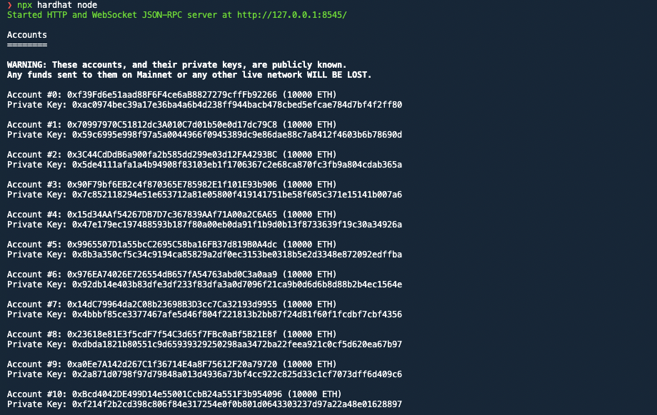

# TP Blockchain

You'll find in this readme the entire description accompanied by screenshots.

- Team members:
  - Wadhah Mahrouk
  - Ghassen Zakraoui
  - Oussema Zouaghi

## Description

We have created an NFT minting website. The price of minting is set at `0.05 ETH`.
the Dapp integrates with metamask to process the payment and use the smart contracts deployed on our local blockchain to handle the transactions.

## Components

You'll find in this repository 3 segments

1. **NFT Generator**: This is a configurable CLI tool written in NestJS that generates our NFT collection. It does the following:

   - Requires multiple [layers](nft-gen/src/assets/Layers/) of png images.
   - Each layer has a rarity score (Common-Uncommon-Epic-Legendary) to create virtual scarcity.
   - Reduces them into a single NFT. Examples:
   <div>
    
    
    
   </div>
   - output their JSON metadata according to OpenSea standard. Example:

   ```Javascript
   {
     "name": "0",
     "description": "The description of the NFT 0",
     "image": "https://firebasestorage.googleapis.com/v0/b/wow-antiafk.appspot.com/o/0.png?alt=media",
     "external_url": "",
     "attributes": [
       { "trait_type": "Background", "value": "50 " },
       { "trait_type": "Body", "value": "50" },
       { "trait_type": "Outfits", "value": "100" },
       { "trait_type": "Eyes", "value": "50" },
       { "trait_type": "Facial", "value": "75" },
       { "trait_type": "Glasses", "value": "50" }
     ],
     "cid": "bafkreifxnzl62mrlt2omuus2m2wqcqd764bmfmeu74wg4klqjnjt6vh2we"
   },
   ```

   - Uploads the metadata file to IPFS, via Pinata SDK.
   - Uploads the PNG image to Firebase to render it on our marketplace. IPFS tends to be slow and inconsistent when displaying resources.

2. **WEB3 BACKEND**: This segment holds our [Smart Contract](web3-backend/contracts/SwagDogs.sol) implementation. Which is adherent to the `ERC721` standard. It works in the following way:

   - The contract is is accompanied by some unit tests written in Javascript. To make sure that it's working as intended.
      You can browse through the test code [here](web3-backend/test/Lock.ts).
   - Because we can't afford deploying to the Ethereum chain, we ran our own local blockchain using Hardhat: It creates a JSON-RPC server that listens for events, creates wallets for dummy users and assigns them `10000 ETH` EACH that we can use for testing. Here is how its start up looks like:
     
   - Afterwards, we'd deploy our contract using the following command:
     `npx hardhat run --network localhost scripts/deploy.ts`.
     .

3. **WEB FRONTEND**: This segment holds the NFT minting website. It's not the prettiest but it does the job.

   - A User must authenticate with his Metamask account first. Otherwise he'd be redirected to metamask login.
     This is what it should look like after you login
     

   - When you click on Mint! You get asked to validate your Transaction through Metamask.
     

   - Once confirmed, You get your NFT transferred to your wallet and 0.05 ETH deducted from your balance.
     
